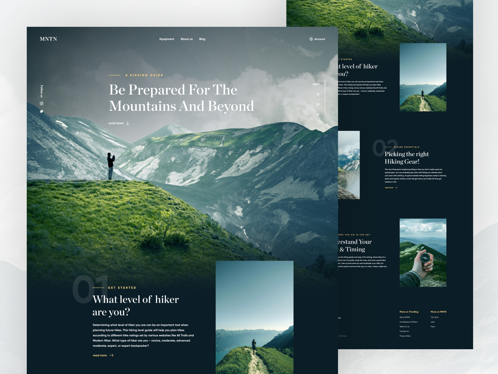

<!-- PROJECT LOGO -->

  

<h3 align="center">MNTN</h3>

  

    Hiking Landing Page

Landing page for you to reminder journey you've had 🏔️🗻

### <a href="https://landmntn.netlify.app/">Live Demo 🚀</a>

## Thanks :)

#### <a href="http://krystonschwarze.com/" style="color: white;"> Kryston Schwarze 💜😊</a>, for the design & inspiration.

|                                                                                                           |                                                                                                                            |     |
| --------------------------------------------------------------------------------------------------------- | -------------------------------------------------------------------------------------------------------------------------- | --- |
|  | <a href="https://www.figma.com/community/file/788675347108478517" style="font-size:18px;font-weight:700;"> View Desgin</a> |
